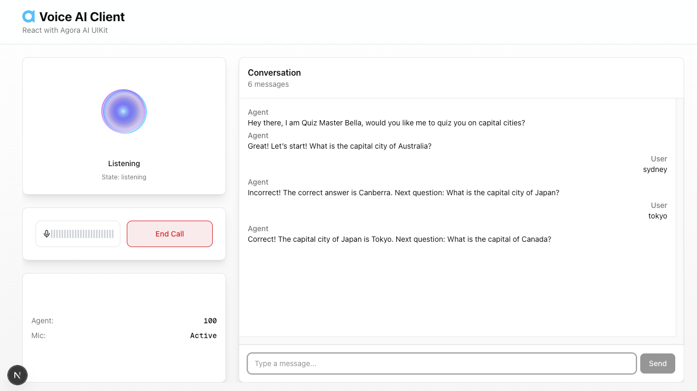
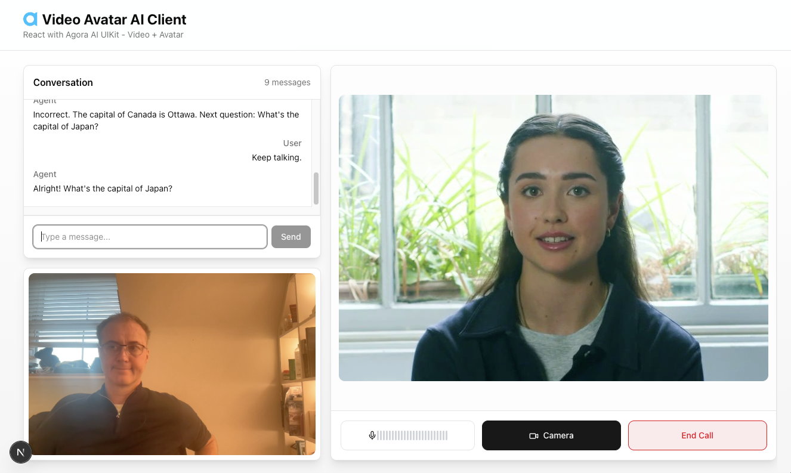

#  Agora Conversational AI

A guide to understanding and implementing Agora voice and video AI agents. Spin
up the sample backend and one of the sample clients or ask AI to do it for you.

- [AI Coding Assistant Guide](#ai-coding-assistant-guide)
- [System Architecture](#system-architecture)
- [Backend Sample](#backend-sample)
- [Client Samples](#client-samples)
- [Companion Servers](#companion-servers)

## AI Coding Assistant Guide

**Comprehensive implementation guide for AI agents** → [AGENT.md](./AGENT.md)

**Example prompt for Claude Code (Voice):**

```
Clone https://github.com/AgoraIO-Conversational-AI/agent-samples and then I want to run the
React Voice AI Agent here on my laptop. Be sure to read the AGENT.md
before you begin building.
```

**Example prompt for Claude Code (Avatar):**

```
Clone https://github.com/AgoraIO-Conversational-AI/agent-samples and then I want to run the
Video AI Agent with Avatar Sample here on my laptop. Be sure to read the AGENT.md
before you begin building.
```

## System Architecture


Your backend serves the client app, generates tokens and credentials, then calls
the Agora Agent REST API to start the AI agent. Both client and agent join the
same channel via SD-RTN where audio, video, and transcription data flow
bidirectionally in real-time.

### Architecture Overview

### Voice AI Client

Your front-end application (web, mobile, or desktop) that captures user inputs
and plays out the AI agent's responses. Built with the Agora RTC SDK and
optionally components from the Agora Conversational AI agent-ui-kit used in the
samples.

### Your Backend Services

Your server-side application that authenticates users, generates Agora tokens,
and orchestrates the AI agent. It serves the client app and calls the Agora REST
API to start/stop agent instances.

### Agora SD-RTN

Agora's Software-Defined Real-Time Network. A global low-latency network that
routes audio, video, and data streams between participants in real-time.

### AI Agent Instance

A managed AI agent that joins the channel as a participant. It listens to user
audio, processes it through STT → LLM → TTS, and streams the response back.

## Backend Sample

To run the server sample that your voice client will connect to, you will need:

**Agora Credentials (always required):**

```bash
APP_ID=                  # Required: Agora Console
APP_CERTIFICATE=         # Required: Agora Console (enable in Project Security)
```

- **APP_ID / APP_CERTIFICATE**
  - Console: [Project Management](https://console.agora.io/project-management)
  - Help: [Manage Agora Account](https://docs.agora.io/en/conversational-ai/get-started/manage-agora-account)
  - Enable the App Certificate under Project Security in the Agora Console

### Option A: Pipeline Mode (Agent Builder) — Simplest

Use a pre-configured pipeline from [Agora Agent Builder](https://console.agora.io). No LLM or TTS API keys needed — the pipeline owns all provider config.

```bash
APP_ID=                  # Required: Agora Console
APP_CERTIFICATE=         # Required: Agora Console
PIPELINE_ID=             # Required: 32-char hex ID from Agent Builder
```

### Option B: Inline Config — Full Control

Configure LLM, TTS, and ASR providers directly in `.env`. This gives you full control over every parameter.

```bash
APP_ID=                  # Required: Agora Console
APP_CERTIFICATE=         # Required: Agora Console
LLM_API_KEY=             # Required: OpenAI or compatible API key
TTS_VENDOR=              # Required: rime, elevenlabs, openai, or cartesia
TTS_KEY=                 # Required: API key for your TTS vendor
TTS_VOICE_ID=            # Required: Voice/speaker ID for your chosen vendor
```

- **LLM**: [OpenAI API Keys](https://platform.openai.com/settings/organization/api-keys)
- **TTS**: [Rime](https://rime.ai/) | [ElevenLabs](https://elevenlabs.io/) | [OpenAI](https://platform.openai.com/) | [Cartesia](https://cartesia.ai/)

### Sample

**[Simple Backend](./simple-backend/)** Python backend for creating AI agents
and generating RTC credentials. Supports local development, cloud instances, and
AWS Lambda deployment.

## Client Samples

### Core Packages

- **[agent-client-toolkit](https://github.com/AgoraIO-Conversational-AI/agent-client-toolkit-ts)** - Core client toolkit published on npm as `agora-agent-client-toolkit` — RTC/RTM connection management, transcript handling, and React hooks
- **[agent-ui-kit](https://github.com/AgoraIO-Conversational-AI/agent-ui-kit)** - React UI components for voice, chat, and video

### Voice Agent Sample

Recommended and complete React JS voice client sample which looks great on any device.

**[React Voice Client](./react-voice-client/)** Responsive React/Next.js voice
client built with SDK packages and UI Kit. Features TypeScript, real-time
transcription display, voice controls, and integrated text chat.



### Video Agent Sample

**[React Video Client with Avatar](./react-video-client-avatar/)** React/Next.js
client with video avatar and local camera support. Includes responsive layouts
and multi-stream video rendering.



## Companion Servers

Optional standalone servers that extend your agent with advanced capabilities.

**[server-custom-llm](https://github.com/AgoraIO-Conversational-AI/server-custom-llm)** —
Custom LLM proxy for RAG, tool calling, conversation memory, and response
formatting. Available in Python, Node.js, and Go.

**[server-mcp](https://github.com/AgoraIO-Conversational-AI/server-mcp)** —
MCP memory server that gives agents persistent per-user memory via tool calling.
Stores and retrieves conversation context across sessions.

### Basic Samples

**[Simple Voice AI Client (No Backend)](./simple-voice-client-no-backend/)** Standalone HTML/JavaScript
client for testing voice agents. Maintains persistent RTC connection allowing
agents to join and leave without client reconnection.

**[Simple Voice AI Client (With Backend)](./simple-voice-client-with-backend/)** Full-featured vanilla
JavaScript client demonstrating end-to-end integration with backend for agent
initialization and voice interaction.
